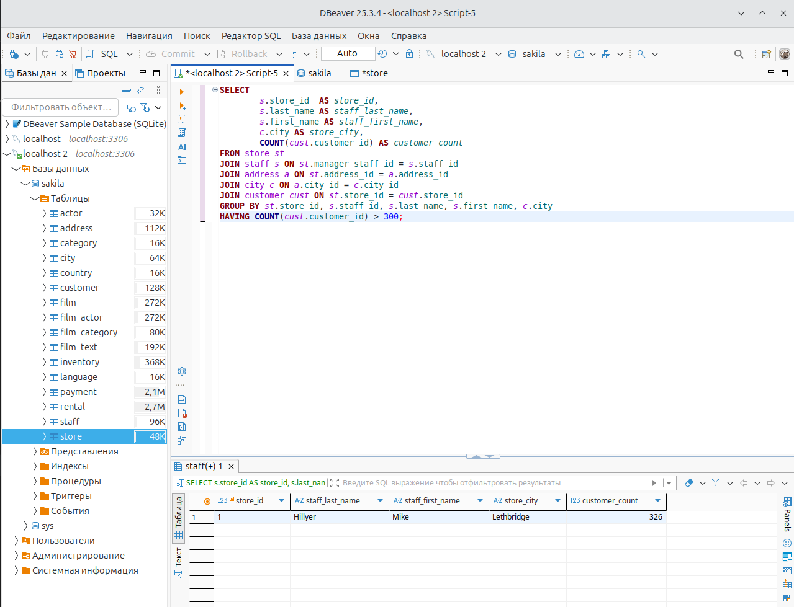
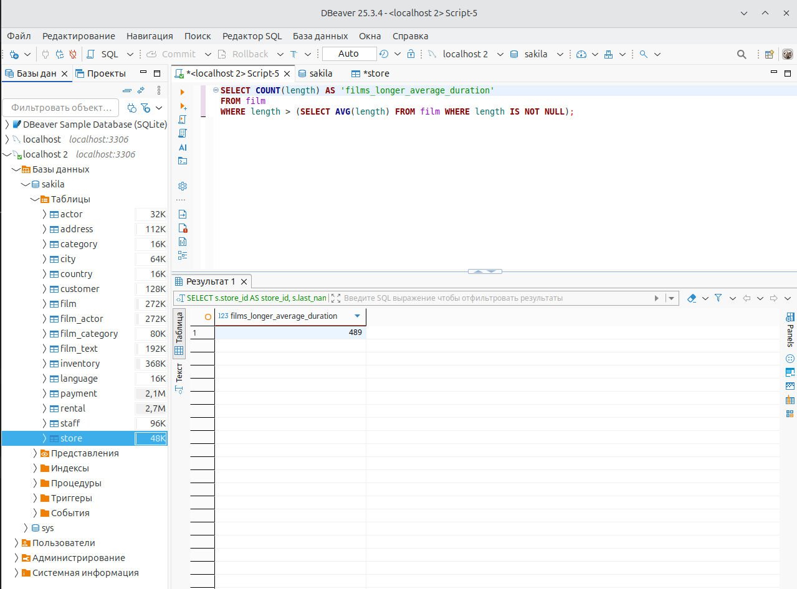
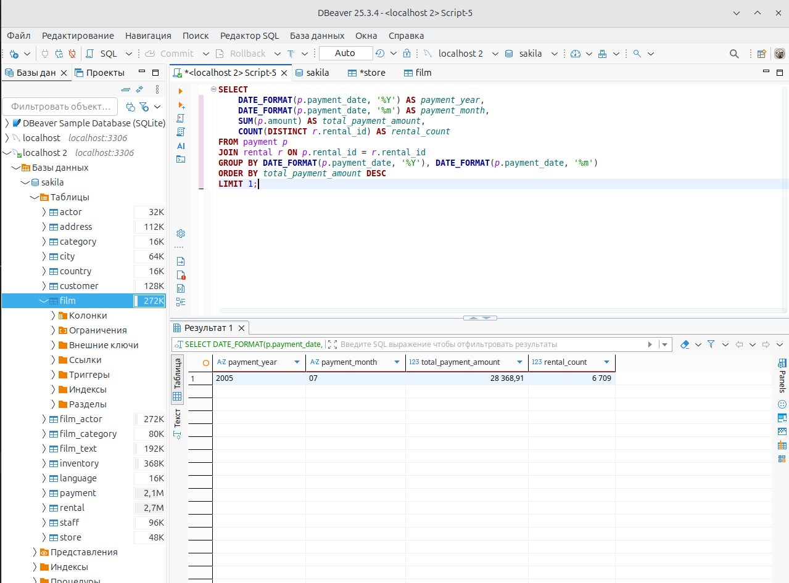

# Домашнее задание к занятию «SQL. Часть 2» Тукаев Айрат

### Задание 1

Одним запросом получите информацию о магазине, в котором обслуживается более 300 покупателей, и выведите в результат следующую информацию: 
- фамилия и имя сотрудника из этого магазина;
- город нахождения магазина;
- количество пользователей, закреплённых в этом магазине.

```
SELECT 
		s.store_id  AS store_id,
		s.last_name AS staff_last_name, 
		s.first_name AS staff_first_name,
		c.city AS store_city,
		COUNT(cust.customer_id) AS customer_count
FROM store st
JOIN staff s ON st.manager_staff_id = s.staff_id
JOIN address a ON st.address_id = a.address_id
JOIN city c ON a.city_id = c.city_id
JOIN customer cust ON st.store_id = cust.store_id
GROUP BY st.store_id, s.staff_id, s.last_name, s.first_name, c.city
HAVING COUNT(cust.customer_id) > 300;
```


### Задание 2

Получите количество фильмов, продолжительность которых больше средней продолжительности всех фильмов.

```
SELECT COUNT(length) AS 'films_longer_average_duration'
FROM film
WHERE length > (SELECT AVG(length) FROM film WHERE length IS NOT NULL);
```


### Задание 3

Получите информацию, за какой месяц была получена наибольшая сумма платежей, и добавьте информацию по количеству аренд за этот месяц.

```
SELECT 
    DATE_FORMAT(p.payment_date, '%Y') AS payment_year,
    DATE_FORMAT(p.payment_date, '%m') AS payment_month,
    SUM(p.amount) AS total_payment_amount,
    COUNT(DISTINCT r.rental_id) AS rental_count
FROM payment p
JOIN rental r ON p.rental_id = r.rental_id
GROUP BY DATE_FORMAT(p.payment_date, '%Y'), DATE_FORMAT(p.payment_date, '%m')
ORDER BY total_payment_amount DESC
LIMIT 1;
```


## Дополнительные задания (со звёздочкой*)
Эти задания дополнительные, то есть не обязательные к выполнению, и никак не повлияют на получение вами зачёта по этому домашнему заданию. Вы можете их выполнить, если хотите глубже шире разобраться в материале.

### Задание 4*

Посчитайте количество продаж, выполненных каждым продавцом. Добавьте вычисляемую колонку «Премия». Если количество продаж превышает 8000, то значение в колонке будет «Да», иначе должно быть значение «Нет».

### Задание 5*

Найдите фильмы, которые ни разу не брали в аренду.
