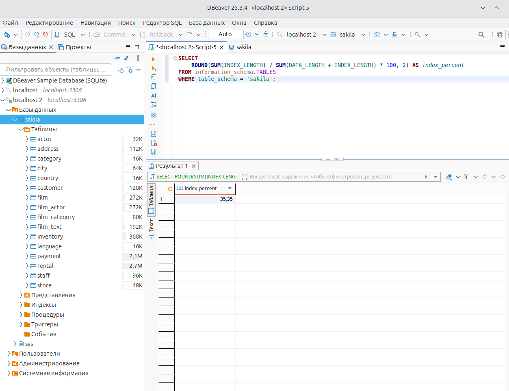
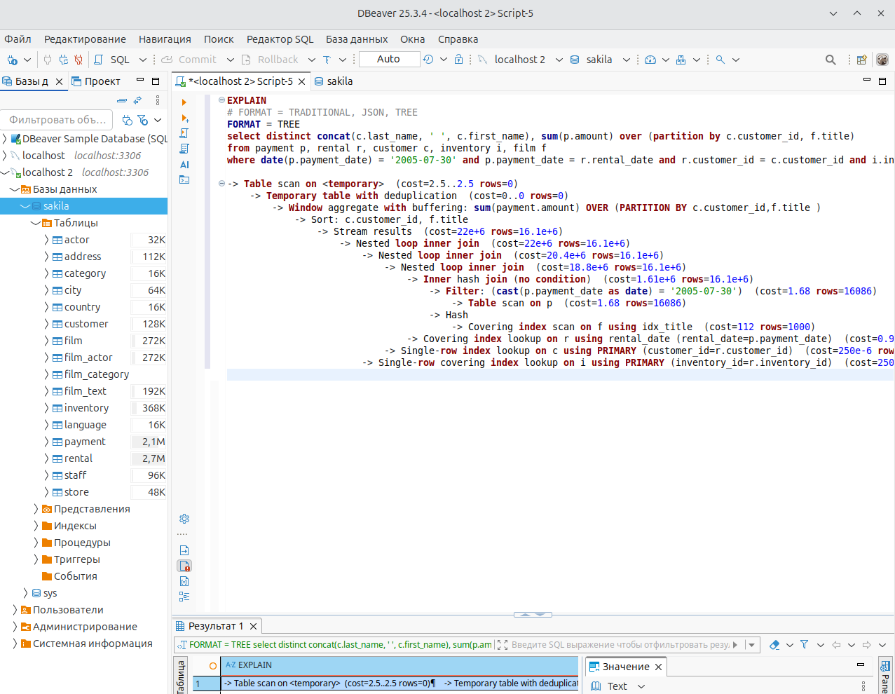
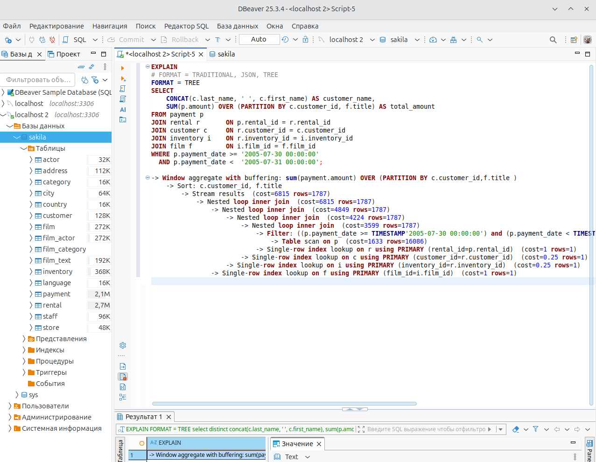

# Домашнее задание к занятию «Индексы» Тукаев Айрат

### Задание 1

Напишите запрос к учебной базе данных, который вернёт процентное отношение общего размера всех индексов к общему размеру всех таблиц.

```
SELECT 
    ROUND(SUM(INDEX_LENGTH) / (SUM(DATA_LENGTH) + SUM(INDEX_LENGTH)) * 100, 2) AS index_percent
FROM information_schema.TABLES
WHERE table_schema = 'sakila';
```


### Задание 2

Выполните explain analyze следующего запроса:
```sql
select distinct concat(c.last_name, ' ', c.first_name), sum(p.amount) over (partition by c.customer_id, f.title)
from payment p, rental r, customer c, inventory i, film f
where date(p.payment_date) = '2005-07-30' and p.payment_date = r.rental_date and r.customer_id = c.customer_id and i.inventory_id = r.inventory_id
```
- перечислите узкие места;
- оптимизируйте запрос: внесите корректировки по использованию операторов, при необходимости добавьте индексы.

1. Замена DISTING и оконной функции sum(p.amount) over (partition by c.customer_id, f.title) на GROUP BY.
2. Использование JOIN с условием ON.
3. Отказаться от функции date().
4. Для ускорения ещё можно добавить индекс INDEX(payment_data) в таблице payment.
5. Если CONCAT является необязательной частью, лучше вывести last_name и first_name отдельно и объединить их на уровне приложения.



```
SELECT 
    CONCAT(c.last_name, ' ', c.first_name) AS customer_name,
    SUM(p.amount) OVER (PARTITION BY c.customer_id, f.title) AS total_amount
FROM payment p
JOIN rental r       ON p.rental_id = r.rental_id
JOIN customer c     ON r.customer_id = c.customer_id
JOIN inventory i    ON r.inventory_id = i.inventory_id
JOIN film f         ON i.film_id = f.film_id
WHERE p.payment_date >= '2005-07-30 00:00:00'
  AND p.payment_date <  '2005-07-31 00:00:00'
GROUP BY
  c.customer_id, c.last_name, c.first_name;
```


## Дополнительные задания (со звёздочкой*)
Эти задания дополнительные, то есть не обязательные к выполнению, и никак не повлияют на получение вами зачёта по этому домашнему заданию. Вы можете их выполнить, если хотите глубже шире разобраться в материале.

### Задание 3*

Самостоятельно изучите, какие типы индексов используются в PostgreSQL. Перечислите те индексы, которые используются в PostgreSQL, а в MySQL — нет.

*Приведите ответ в свободной форме.*
