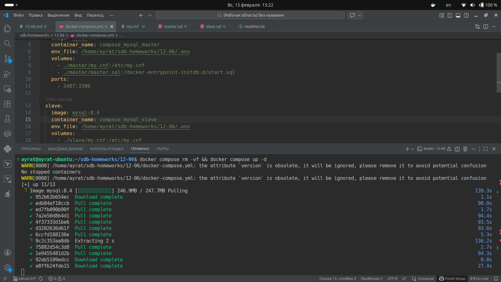
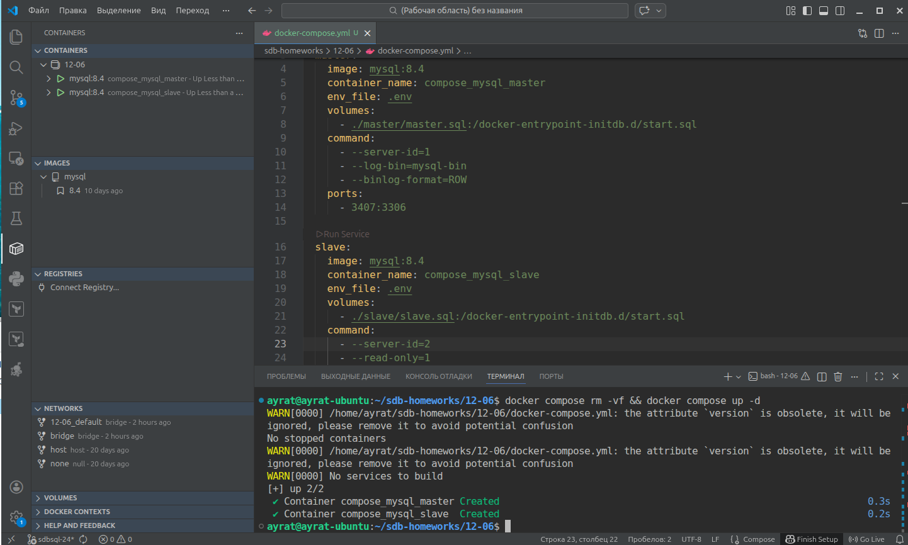
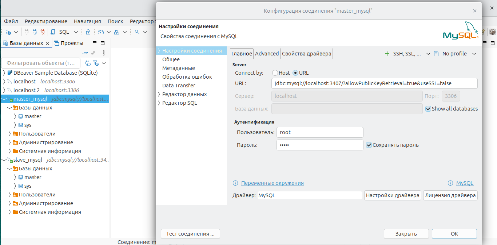
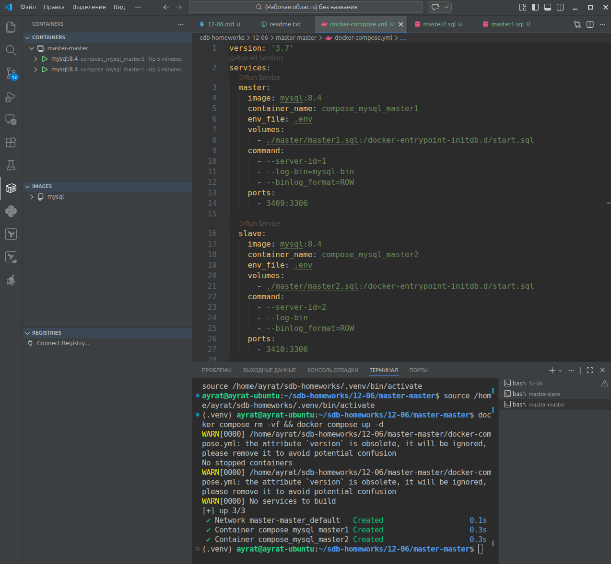
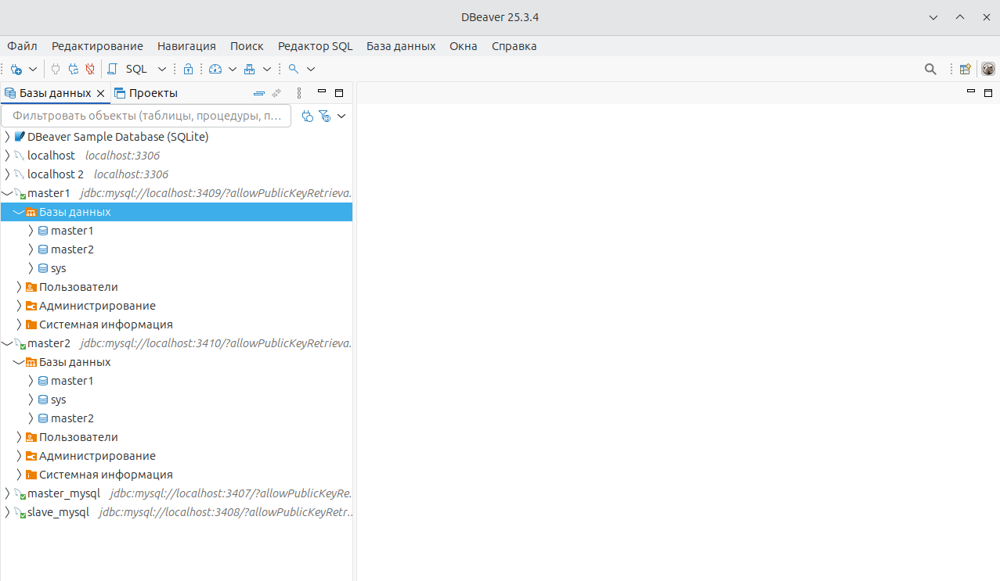

# Домашнее задание к занятию «Репликация и масштабирование. Часть 1» Тукаев Айрат

---

### Задание 1

На лекции рассматривались режимы репликации master-slave, master-master, опишите их различия.

*Ответить в свободной форме.*

Основное отличие master-slave от master-master в том что репликации создаются только на slave. В master-master репликации могут создаваться и на первом мастере и на втором, в зависимости куда вносятся данные.

---

### Задание 2

Выполните конфигурацию master-slave репликации, примером можно пользоваться из лекции.

*Приложите скриншоты конфигурации, выполнения работы: состояния и режимы работы серверов.*

Сервера создал с помощью docker compose.

```
version: '3.7'
services:
  master:
    image: mysql:8.4
    container_name: compose_mysql_master
    env_file: .env
    volumes:
      - ./master/master.sql:/docker-entrypoint-initdb.d/start.sql
    command:
      - --server-id=1
      - --log-bin=mysql-bin
      - --binlog_format=ROW
    ports:
      - 3407:3306

  slave:
    image: mysql:8.4
    container_name: compose_mysql_slave
    env_file: .env
    volumes:
      - ./slave/slave.sql:/docker-entrypoint-initdb.d/start.sql
    command:
      - --server-id=2
      - --read_only=1
    ports:
      - 3408:3306
```
Процесс создания:



Сервера в работе:



В DBeaver подключился к серверам. В master сервере создал базу данных "master". База появилась на slave сервере:


---

## Дополнительные задания (со звёздочкой*)
Эти задания дополнительные, то есть не обязательные к выполнению, и никак не повлияют на получение вами зачёта по этому домашнему заданию. Вы можете их выполнить, если хотите глубже шире разобраться в материале.

---

### Задание 3* 

Выполните конфигурацию master-master репликации. Произведите проверку.

*Приложите скриншоты конфигурации, выполнения работы: состояния и режимы работы серверов.*

Для выполнения конфигурации master-master внёс изменения в файлы docker compose и в файлы инициализации мастера (2 файла).

```
version: '3.7'
services:
  master:
    image: mysql:8.4
    container_name: compose_mysql_master1
    env_file: .env
    volumes:
      - ./master/master1.sql:/docker-entrypoint-initdb.d/start.sql
    command:
      - --server-id=1
      - --log-bin=mysql-bin
      - --binlog_format=ROW
    ports:
      - 3409:3306

  slave:
    image: mysql:8.4
    container_name: compose_mysql_master2
    env_file: .env
    volumes:
      - ./master/master2.sql:/docker-entrypoint-initdb.d/start.sql
    command:
      - --server-id=2
      - --log-bin
      - --binlog_format=ROW
    ports:
      - 3410:3306
```

В результате в данные копируются в обеих направлениях. Результаты:



