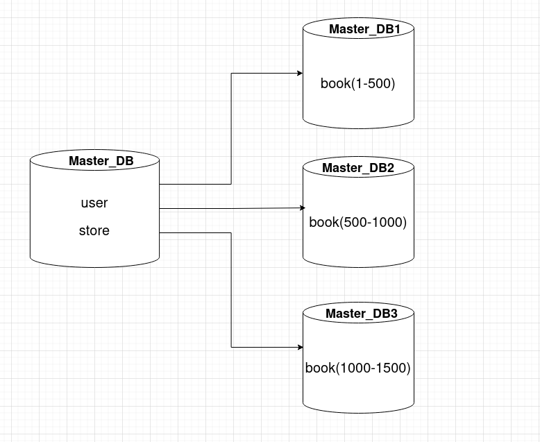
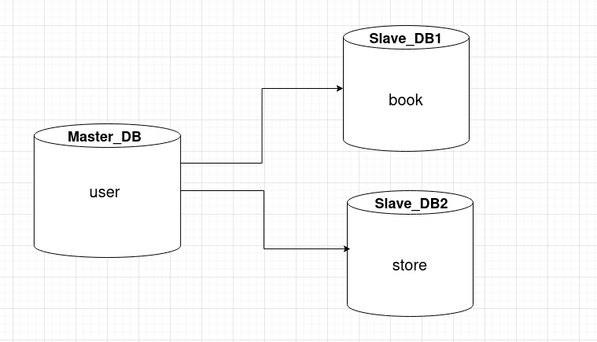

# Домашнее задание к занятию «Репликация и масштабирование. Часть 2» Тукаев Айрат

---

### Задание 1

Опишите основные преимущества использования масштабирования методами:

- активный master-сервер и пассивный репликационный slave-сервер; 
- master-сервер и несколько slave-серверов;

*Дайте ответ в свободной форме.*

Оба относятся к горизонтальному масштабированию. Что означает увеличение производительности за счёт разделения данных. Вид репликация.

**Преимущества активного master-сервера и пассивного репликационного slave-сервера:**

*Slave-сервер снижает нагрузку на master-сервер, так как он доступен для чтения;
*На slave-сервере выполняется резервное копирование и в случае отказа master-сервера может использоваться для восстановления данных или даже может взять на себя роль masterа после перенастройки.

**Преимущества master-сервера и нескольких slave-серверов:**

*По slave-серверам распределяется нагрузка что увеличивает производительность;
*Масштабируемость можно увеличивать или уменьшать в зависимости от нагрузки;
*В случае отказа master-сервера один из slave-серверов может использоваться в качестве masterа после перенастройки.

---

### Задание 2

Разработайте план для выполнения горизонтального и вертикального шаринга базы данных. База данных состоит из трёх таблиц: 

- пользователи, 
- книги, 
- магазины (столбцы произвольно). 

Опишите принципы построения системы и их разграничение или разбивку между базами данных.

*Пришлите блоксхему, где и что будет располагаться. Опишите, в каких режимах будут работать сервера.* 

**Горизонтальный шардинг**

Думаю что наибольшая нагрузка будет на базу данных книг. Поэтому выполню шардинг этой базы по серверам.Будут работать в режиме записи и чтения.

**Вертикальный шардинг**

Каждая база данных будет распологаться на своем сервере. На базу данных user будет выполнятся запись и чтение, а по другим чтение данных.

## Дополнительные задания (со звёздочкой*)
Эти задания дополнительные, то есть не обязательные к выполнению, и никак не повлияют на получение вами зачёта по этому домашнему заданию. Вы можете их выполнить, если хотите глубже шире разобраться в материале.

---
### Задание 3*

Выполните настройку выбранных методов шардинга из задания 2.

*Пришлите конфиг Docker и SQL скрипт с командами для базы данных*.
