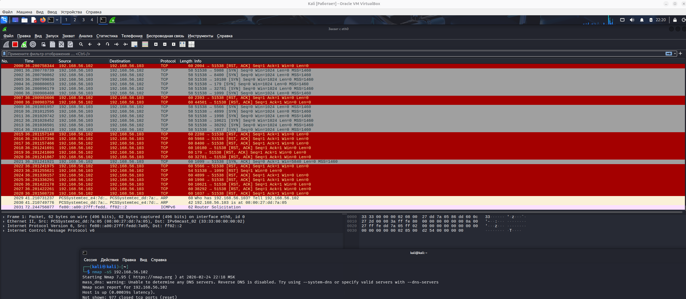
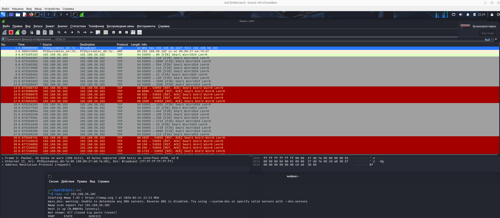
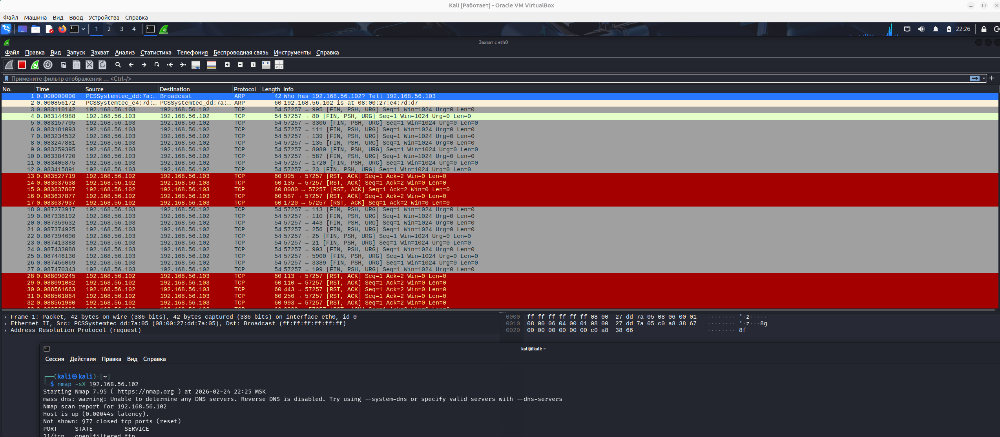
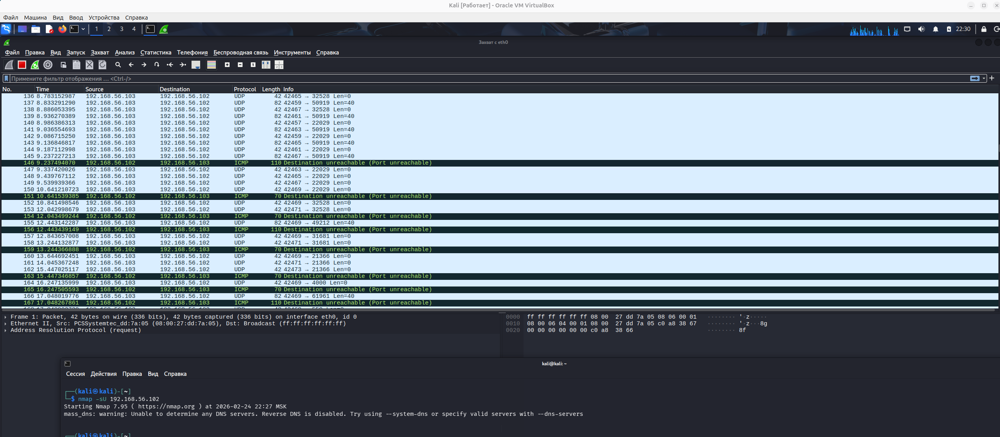

# Домашнее задание к занятию «Уязвимости и атаки на информационные системы» Тукаев Айрат


### Задание 1

Скачайте и установите виртуальную машину Metasploitable: https://sourceforge.net/projects/metasploitable/.

Это типовая ОС для экспериментов в области информационной безопасности, с которой следует начать при анализе уязвимостей.

Просканируйте эту виртуальную машину, используя **nmap**.

Попробуйте найти уязвимости, которым подвержена эта виртуальная машина.

Сами уязвимости можно поискать на сайте https://www.exploit-db.com/.

Для этого нужно в поиске ввести название сетевой службы, обнаруженной на атакуемой машине, и выбрать подходящие по версии уязвимости.

Ответьте на следующие вопросы:

- Какие сетевые службы в ней разрешены?
- Какие уязвимости были вами обнаружены? (список со ссылками: достаточно трёх уязвимостей)
  
*Приведите ответ в свободной форме.*  

**Ответ:**  
Разрешены следующие сетевые службы:  
- ProFTPD;  
- OpenSSH;  
- Postfix;  
- Samba;   
- MySQL;  
- PostgreSQL;  
- VNC.  

Обнаружены следующие уязвимости:  
1) Установлена служба ftp версий vsftpd 2.3.4. Эта версия была скопрометирована. Бэкдор в vsftpd 2.3.4 открывал командную оболочку на порту 6200. Её не рекомендуется использовать в реальных системах.   
[Ссылка](https://www.exploit-db.com/exploits/49757)  

2) Установлена служба rpcbind. Имеет уязвимость связанная с неограниченным распределением ресурсов, недостаточной проверки входных данных.  
[Ссылка](https://www.exploit-db.com/exploits/41974) 

3) Установлена служба PostgreSQL DB 8.3.0 - 8.3.7. Имеет уязвимость которая выполнять произвольный код через инъекцию полезной нагрузки.  
[Ссылка](https://www.exploit-db.com/exploits/32849)  

### Задание 2

Проведите сканирование Metasploitable в режимах SYN, FIN, Xmas, UDP.

Запишите сеансы сканирования в Wireshark.

Ответьте на следующие вопросы:

- Чем отличаются эти режимы сканирования с точки зрения сетевого трафика?
- Как отвечает сервер?

*Приведите ответ в свободной форме.*

**Ответ:** 

*Режим сканирования SYN*  
```
nmap -sS 192.168.56.102
```


Nmap отправляет пакеты SYN на целевой хост и анализирует ответы для определения открытых и закрытых портов. Наличие флагов SYN/ACK в ответе указывает на то, что порт удалённой машины открыт и прослушивается. Флаг RST в ответе означает обратное. Если Nmap принял пакет SYN/ACK, то в ответ немедленно отправляет RST-пакет для сброса ещё не установленного соединения.

*Режим сканирования FIN*  
```
nmap -sF 192.168.56.102
```
  

В отличие от SYN-сканирования, которое пытается установить соединение, FIN-сканирование просто отправляет пакет FIN и анализирует ответ. Nmap отправляет пакет FIN без предварительного установления соединения с целевым хостом. Поскольку ранее соединение не было установлено, целевой хост отвечает RST-пакетом для сброса соединения. Если в ответ приходит RST-пакет, то порт считается закрытым. Отсутствие ответа означает, что порт открыт|фильтруется. Порт помечается как фильтруется, если в ответ приходит ICMP-ошибка о недостижимости.

*Режим сканирования Xmas*  
```
nmap -sX 192.168.56.102
```
  

Этот режим полезен для идентификации открытых или отфильтрованных портов на целевой системе. Если порт закрыт, сервер отвечает кодом RST. Если порт открыт или фильтруется, ответа не будет.

*Режим сканирования UDP*  
```
nmap -sU 192.168.56.102
```
  

Nmap отправляет UDP-пакет без данных на каждый целевой порт. Для большинства портов пакет пустой, но для некоторых распространённых портов отправляется пакет с данными, специфичными для протокола. Если в ответ приходит ICMP-ошибка о недостижимости порта (тип 3, код 3), значит порт закрыт. Другие ICMP-ошибки недостижимости (тип 3, коды 1, 2, 9, 10 или 13) указывают на то, что порт фильтруется. Иногда служба отвечает UDP-пакетом, указывая на то, что порт открыт. Если после нескольких попыток не было получено никакого ответа, порт классифицируется как открыт|фильтруется — это означает, что порт может быть открыт или, возможно, пакетный фильтр блокирует его. 
