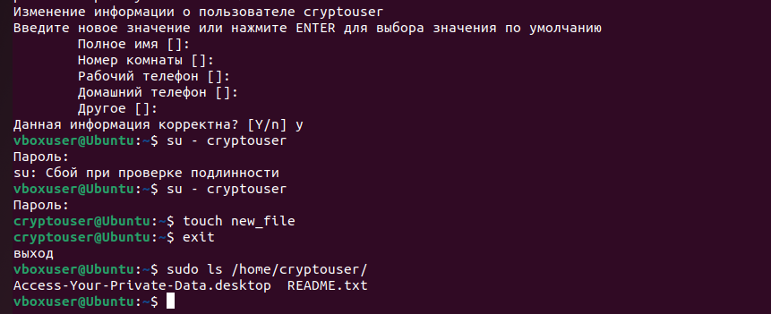
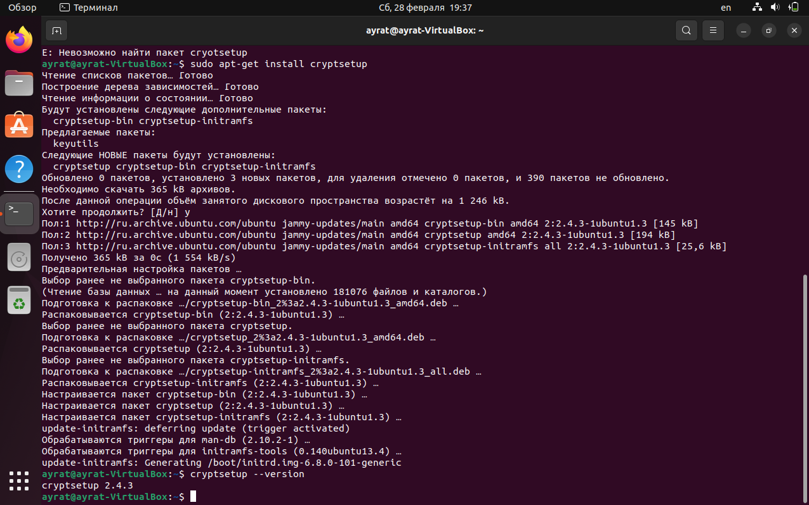
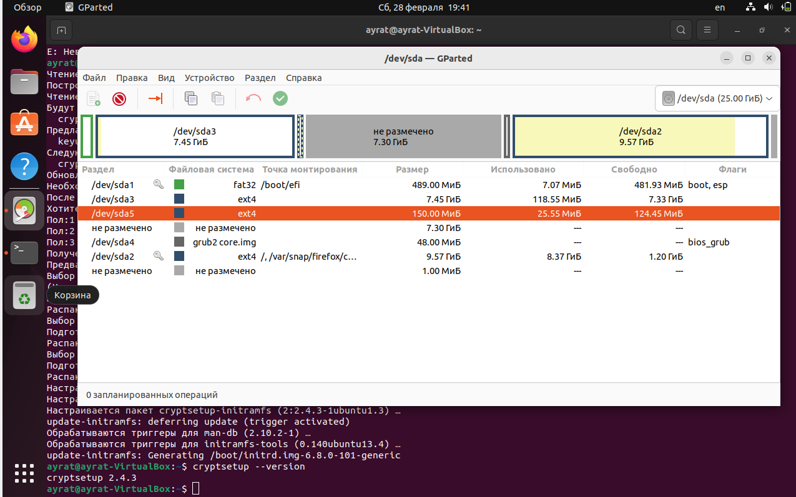
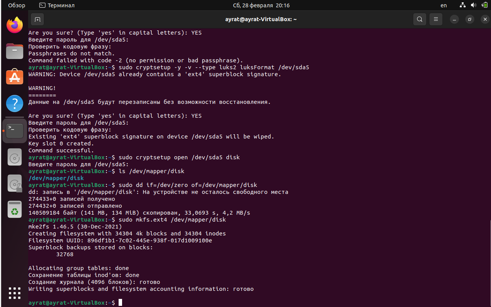

# Домашнее задание к занятию  «Защита хоста» Тукаев Айрат

### Задание 1

1. Установите **eCryptfs**.
2. Добавьте пользователя cryptouser.
3. Зашифруйте домашний каталог пользователя с помощью eCryptfs.

*В качестве ответа  пришлите снимки экрана домашнего каталога пользователя с исходными и зашифрованными данными.*  

**Ответ:**  
Использованные команды:  
```
sudo apt install ecryptfs-utils
sudo adduser --encrypt-home cryptouser
su - cryptouser
touch new_file
exit
sudo ls /home/cryptouser/
```


### Задание 2

1. Установите поддержку **LUKS**.
2. Создайте небольшой раздел, например, 100 Мб.
3. Зашифруйте созданный раздел с помощью LUKS.

*В качестве ответа пришлите снимки экрана с поэтапным выполнением задания.*

**Ответ:**  
Использованные команды:  
```
sudo apt install gparted                                  # установка gparted
sudo apt-get install cryptsetup                           # установка LUKS
cryptsetup --version                                      # проверка установки
sudo cryptsetup -y -v --type luks2 luksFormat /dev/sda5   # подготовка раздела
sudo cryptsetup open /dev/sda5 disk                       # монтирование раздела
ls /dev/mapper/disk
sudo dd if=/dev/zero of=/dev/mapper/disk                  # форматирование раздела
sudo mkfs.ext4 /dev/mapper/disk
mkdir .secret                                             # монтирование "открытого раздела"
sudo mount /dev/mapper/disk .secret/                      
sudo umount .secret                                       # завершение работы
sudo cryptsetup luksClose disk

```
Установил LUKS:  


Создал раздел:  


Зашифровал созданный раздел:



## Дополнительные задания (со звёздочкой*)

Эти задания дополнительные, то есть не обязательные к выполнению, и никак не повлияют на получение вами зачёта по этому домашнему заданию. Вы можете их выполнить, если хотите глубже шире разобраться в материале

### Задание 3 *

1. Установите **apparmor**.
2. Повторите эксперимент, указанный в лекции.
3. Отключите (удалите) apparmor.


*В качестве ответа пришлите снимки экрана с поэтапным выполнением задания.*


