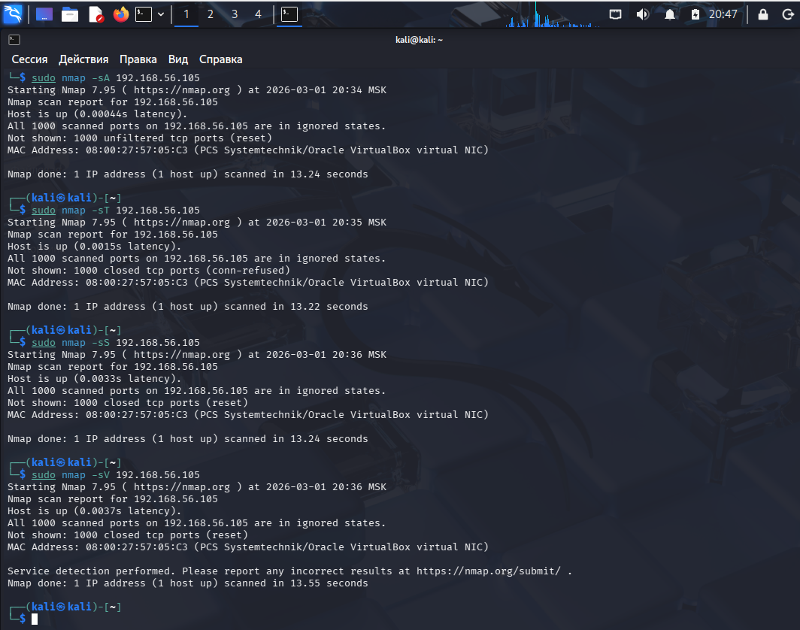
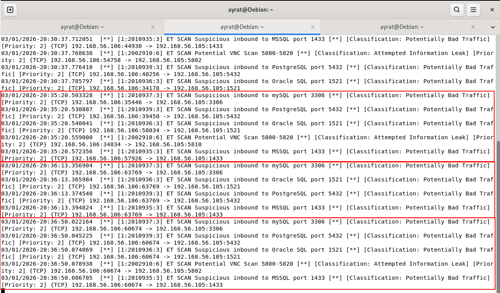
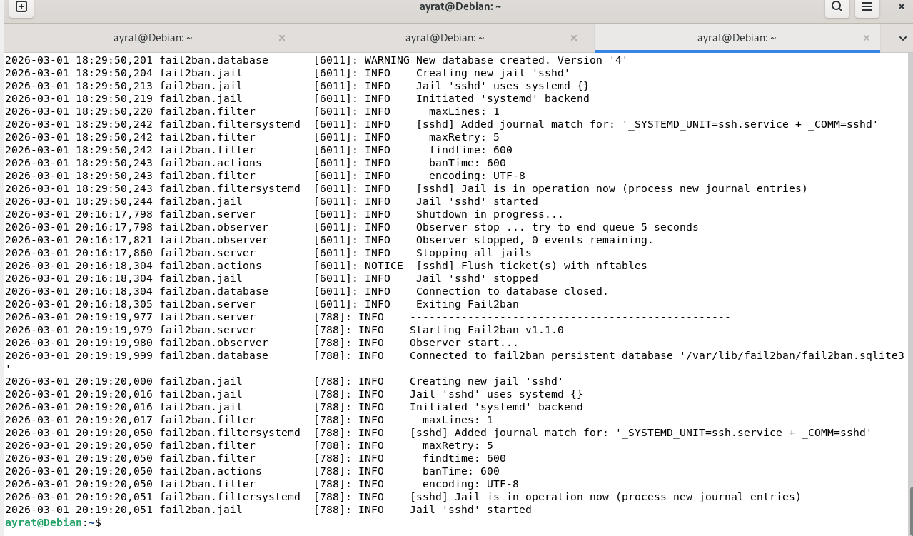
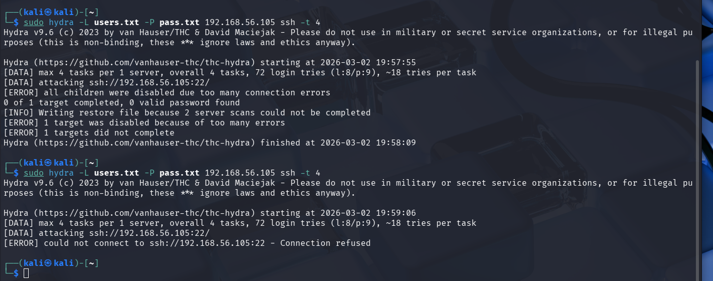
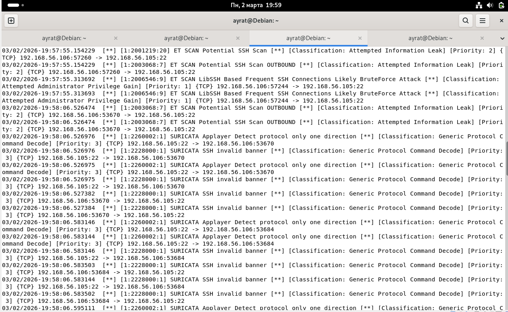
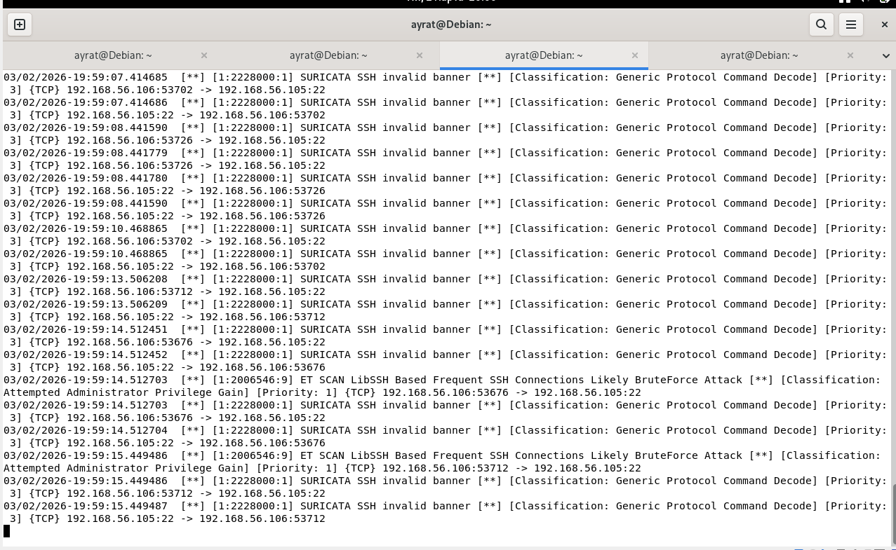
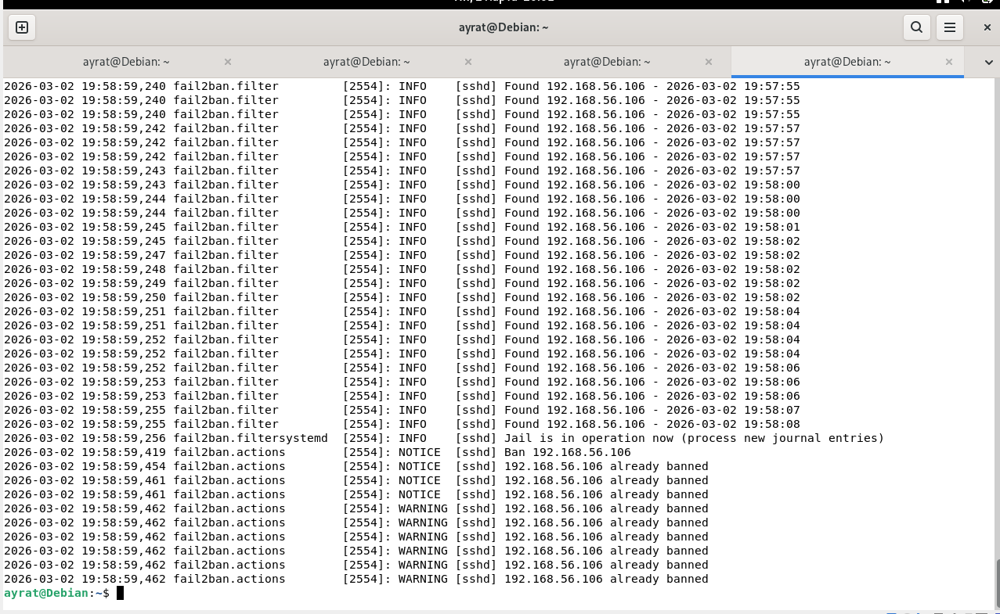

# Домашнее задание к занятию «Защита сети» Тукаев Айрат

### Подготовка к выполнению заданий

1. Подготовка защищаемой системы:

- установите **Suricata**,
- установите **Fail2Ban**.

2. Подготовка системы злоумышленника: установите **nmap** и **thc-hydra** либо скачайте и установите **Kali linux**.

Обе системы должны находится в одной подсети.

------

### Задание 1

Проведите разведку системы и определите, какие сетевые службы запущены на защищаемой системе:

**sudo nmap -sA < ip-адрес >**

**sudo nmap -sT < ip-адрес >**

**sudo nmap -sS < ip-адрес >**

**sudo nmap -sV < ip-адрес >**

По желанию можете поэкспериментировать с опциями: https://nmap.org/man/ru/man-briefoptions.html.

*В качестве ответа пришлите события, которые попали в логи Suricata и Fail2Ban, прокомментируйте результат.*

**Ответ:**  

Выполненные команды на системе злоумышленника:  

Логи Suricata:  

Логи Fail2Ban:  

В логах Suricata можно увидеть что происходило подозрительное сканирование. Сработал во всех случаях кроме первого. Определил как "Потенциально опасный трафик" и "Возможна утечка информации".
В логах Fail2Ban ничего не вывел. В данном примере мы сканировали порты машины, а не подбирали логины - пароли к системе. Поэтому и нет сработки.

------

### Задание 2

Проведите атаку на подбор пароля для службы SSH:

**hydra -L users.txt -P pass.txt < ip-адрес > ssh**

1. Настройка **hydra**: 
 
 - создайте два файла: **users.txt** и **pass.txt**;
 - в каждой строчке первого файла должны быть имена пользователей, второго — пароли. В нашем случае это могут быть случайные строки, но ради эксперимента можете добавить имя и пароль существующего пользователя.

Дополнительная информация по **hydra**: https://kali.tools/?p=1847.

2. Включение защиты SSH для Fail2Ban:

-  открыть файл /etc/fail2ban/jail.conf,
-  найти секцию **ssh**,
-  установить **enabled**  в **true**.

Дополнительная информация по **Fail2Ban**:https://putty.org.ru/articles/fail2ban-ssh.html.

*В качестве ответа пришлите события, которые попали в логи Suricata и Fail2Ban, прокомментируйте результат.*

**Ответ:**  
Была проведена атака на подбор пароля с отключенным Fail2Ban на атакуемой машине и включенным Fail2Ban.
Скрин системы злоумышленника:  

Логи Suricata на атакуемой машине:  

Логи Fail2Ban на атакуемой машине:  

В качестве атакуемой машины использовалась машина с установленной операционной системой Debian GNU/Linux 13 (trixie). В первом случае Fail2Ban отключен. Время атаки 19:58. Почему то атака завершилась с ошибкой "все дочерние устройства были отключены из-за слишком большого количества ошибок подключения". В файлах users.txt и pass.txt были прописаны действующие логин и пароль и выданы соответствующие права на файлы. Думаю в установленной системе есть другая защита от подбора паролей. Другого объяснения не могу найти.  
Во втором случае Fail2Ban сработал успешно, забанил ip адрес атакующего. 
В логах Suricata зафиксированы все попытки подбора по SSH.